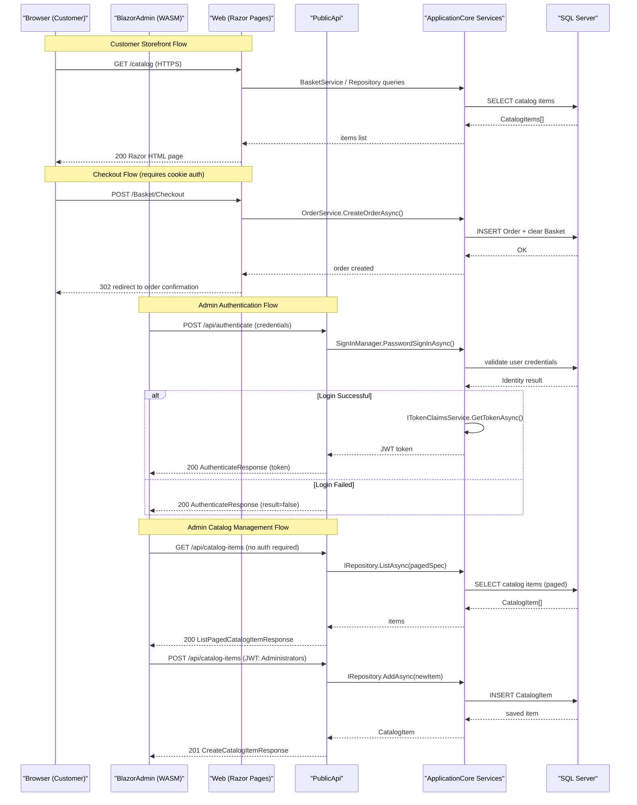

# API & Service Communication Contracts

The eShopOnWeb solution exposes 10 REST API endpoints across two independently deployable services: a customer-facing Web application (Razor Pages/MVC) and a Public REST API (ASP.NET Core Minimal API / Ardalis.ApiEndpoints) used by the Blazor admin SPA. All communication is synchronous HTTP/HTTPS with no message broker or async messaging.

## Service Catalog

| Service | Port | Category | Purpose |
|---|---|---|---|
| Web (eShopOnWeb.Web) | 44315 (dev), 443 (prod) | API Layer / Business | Customer-facing storefront: Razor Pages, MVC controllers, cookie auth, basket, checkout |
| PublicApi (eShopOnWeb.PublicApi) | 5099 (dev), 443 (prod) | API Layer | REST API for catalog management and authentication; consumed by BlazorAdmin SPA |
| BlazorAdmin (hosted) | — (served from Web) | API Layer / Frontend | Blazor WebAssembly SPA served as static files from the Web project |

## API Endpoints Inventory

| Service | Method | Path | Request Type | Response Type | Auth |
|---|---|---|---|---|---|
| PublicApi | POST | /api/authenticate | AuthenticateRequest (body) | AuthenticateResponse (200) | None (public) |
| PublicApi | GET | /api/catalog-items | ListPagedCatalogItemRequest (query: pageSize, pageIndex, catalogBrandId, catalogTypeId) | ListPagedCatalogItemResponse (200) | None (public) |
| PublicApi | GET | /api/catalog-items/{catalogItemId} | GetByIdCatalogItemRequest (path) | GetByIdCatalogItemResponse (200), 404 | None (public) |
| PublicApi | POST | /api/catalog-items | CreateCatalogItemRequest (body) | CreateCatalogItemResponse (201), 400 | JWT — Administrators role |
| PublicApi | PUT | /api/catalog-items | UpdateCatalogItemRequest (body) | UpdateCatalogItemResponse (200), 404 | JWT — Administrators role |
| PublicApi | DELETE | /api/catalog-items/{catalogItemId} | DeleteCatalogItemRequest (path) | DeleteCatalogItemResponse (200), 404 | JWT — Administrators role |
| PublicApi | GET | /api/catalog-brands | — | ListCatalogBrandsResponse (200) | None (public) |
| PublicApi | GET | /api/catalog-types | — | ListCatalogTypesResponse (200) | None (public) |
| Web | POST | /api/account/login | LoginRequest (JSON, internal) | LoginResponse with JWT/cookie | None (public) |
| Web | GET/POST | /Basket/\* | Razor Page model | Razor page HTML | Cookie (checkout requires auth) |

> Note: The Web project also exposes MVC controller routes (`/Order`, `/Manage`, `/User`) rendered as server-side Razor views; these are not REST endpoints and are not listed above.

## Management & Observability Endpoints

| Service | Endpoint | Custom Metrics |
|---|---|---|
| Web | /health | API health check (`api_health_check`) and home page health check (`home_page_health_check`) |
| Web | /allservices | Lists all registered DI services (development only, via Ardalis.ListStartupServices) |
| PublicApi | /swagger | Swashbuckle OpenAPI/Swagger UI with annotations |
| PublicApi | /swagger/v1/swagger.json | OpenAPI 3 JSON spec generated by Swashbuckle |

No Prometheus, Application Insights, or OpenTelemetry metrics endpoints are configured.

## DTOs & Contracts

All DTOs are defined as plain C# classes (not records) in the service that owns them. There are no shared DTO libraries between Web and PublicApi — BlazorShared contains only authorization constants and shared Blazor models.

**PublicApi service-level DTOs:**
- `AuthenticateRequest` / `AuthenticateResponse` — Login credential input and JWT token response
- `CatalogItemDto` — Flattened read model for catalog items (id, name, description, price, picture URI, brand/type IDs)
- `ListPagedCatalogItemRequest` / `ListPagedCatalogItemResponse` — Paged catalog query parameters and paginated result
- `GetByIdCatalogItemRequest` / `GetByIdCatalogItemResponse` — Single item lookup
- `CreateCatalogItemRequest` / `CreateCatalogItemResponse` — Create mutation with item fields
- `UpdateCatalogItemRequest` / `UpdateCatalogItemResponse` — Full update mutation
- `DeleteCatalogItemRequest` / `DeleteCatalogItemResponse` — Delete by ID
- `CatalogBrandDto` / `ListCatalogBrandsResponse` — Brand read model and list
- `CatalogTypeDto` / `ListCatalogTypesResponse` — Type read model and list

All DTOs are mutable C# classes. No protobuf or GraphQL schemas exist. Swashbuckle Annotations (`[SwaggerOperation]`) are used on the Auth endpoint; Minimal API `.Produces<T>()` decorators document response types for other endpoints. Serialization uses `System.Text.Json` (ASP.NET Core default).

## Communication Patterns

**Synchronous (REST over HTTPS):**
- BlazorAdmin WASM communicates exclusively with the PublicApi via `HttpClient` using absolute base URLs configured at startup (`baseUrls.apiBase`).
- No service-to-service REST calls exist between Web and PublicApi at runtime — they are independently deployed and share only the SQL Server databases.
- Internal calls within each service are direct in-process method calls (DI-wired services and repositories).

**Asynchronous:** No message queues, event bus, or pub/sub patterns are in use.

**Resilience:** No circuit breaker (Polly), retry policies, or timeouts are configured at the HTTP client or infrastructure level. The `CatalogItemListPagedEndpoint` includes a hard-coded `await Task.Delay(1000)` simulating latency (likely a testing artifact).

**Service Discovery:** No service discovery mechanism (Consul, Eureka, Azure Service Discovery) is used. Service URLs are hardcoded in `appsettings.json` (`baseUrls.apiBase`, `baseUrls.webBase`) and overridden via environment variables or Azure Key Vault in production.

**API Gateway:** No API gateway layer is present. BlazorAdmin calls the PublicApi directly.

**Security Posture:**
- **Web application**: Cookie-based ASP.NET Core Identity authentication. All checkout pages require authentication (`options.Conventions.AuthorizePage("/Basket/Checkout")`). HTTPS enforced via `UseHttpsRedirection` and `CookieSecurePolicy.Always`.
- **PublicApi**: JWT ****** (HS256, issued by `IdentityTokenClaimService`). Write endpoints (POST/PUT/DELETE on catalog items) require `[Authorize(Roles = "Administrators", AuthenticationSchemes = JwtBearerDefaults)]`. Read endpoints (GET catalog items, brands, types) and the authenticate endpoint are publicly accessible without authentication.
- TLS is configured and enforced in both services. No mTLS or API key authentication is used.

## Service Technology Matrix

| Service | Web Framework | Data Access | Discovery | Gateway | Health Checks | Cache | Metrics |
|---|---|---|---|---|---|---|---|
| Web | ASP.NET Core MVC + Razor Pages | EF Core (SqlServer + InMemory) | None (hardcoded URLs) | None | Yes (/health) | IMemoryCache | None |
| PublicApi | ASP.NET Core Minimal API + ApiEndpoints | EF Core (SqlServer + InMemory) | None (hardcoded URLs) | None | No | None | Swagger/OpenAPI |
| BlazorAdmin | Blazor WebAssembly | HttpClient (REST) | None | None | No | LocalStorage | None |

## Service Communication Sequence

