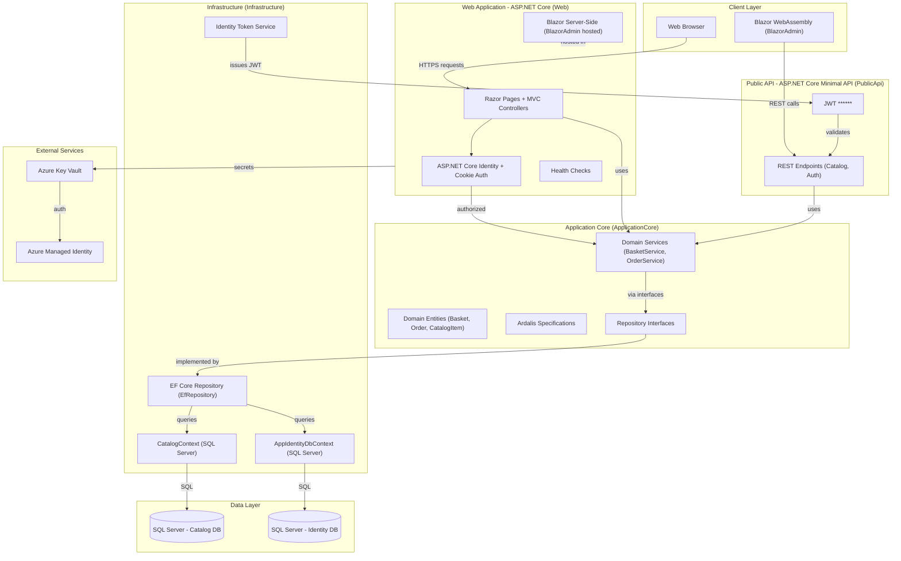
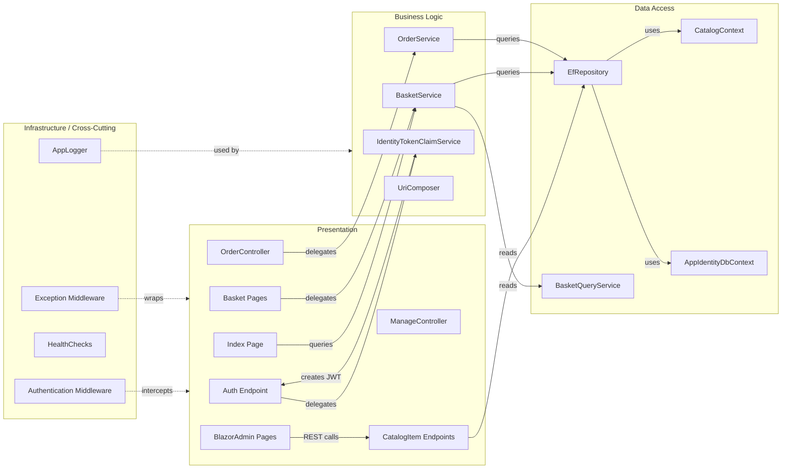

# Architecture Diagram

eShopOnWeb is a multi-project ASP.NET Core reference application implementing a modular, layered architecture with a Razor Pages / MVC web frontend, a Blazor WebAssembly admin panel, and a separate REST API service.

## Application Architecture

### Technology Stack Summary

| Layer | Technology | Version | Purpose |
|---|---|---|---|
| Presentation (Web) | ASP.NET Core Razor Pages + MVC | .NET 8 | Server-side web UI for storefront |
| Presentation (Admin) | Blazor WebAssembly | .NET 8 | SPA admin panel hosted in the web app |
| Presentation (Shared) | BlazorShared | .NET 8 | Shared Blazor models and DTOs |
| API | ASP.NET Core Minimal Endpoints | .NET 8 | Public REST API for catalog and auth |
| Application Core | .NET Class Library | .NET 8 | Domain entities, services, interfaces |
| Infrastructure | Entity Framework Core | 8.x | Data access, Identity, repository impl. |
| Database | SQL Server (localdb / Azure SQL) | — | Catalog and Identity data stores |
| Authentication | ASP.NET Core Identity + JWT ****** — | Cookie auth (Web) and JWT auth (API) |
| Dependency Injection | ASP.NET Core built-in DI | — | Service registration and resolution |
| Configuration Secrets | Azure Key Vault | — | Production secret management |
| Health Checks | ASP.NET Core Health Checks | — | API and homepage liveness probes |

### Data Storage & External Services

The application uses two SQL Server databases: `CatalogDb` (catalog items, brands, types, orders, baskets) and an `Identity` database (users, roles) both accessed via Entity Framework Core. In local/development mode these are SQL Server LocalDB instances; in production they are Azure SQL databases with connection strings retrieved from Azure Key Vault. An in-memory EF Core provider is used for integration tests. No cache or message broker is currently used.

### Key Architectural Decisions

- **Clean Architecture with repository pattern**: Application Core defines domain entities and repository interfaces; Infrastructure implements EF Core repositories (`EfRepository`) using Ardalis.Specification for query abstraction.
- **Dual authentication schemes**: The Web project uses cookie-based ASP.NET Core Identity; the PublicApi project uses JWT ****** issued by `IdentityTokenClaimService`.
- **Blazor WebAssembly hosted within MVC**: `BlazorAdmin` is a WASM SPA served as static files from the Web project, communicating with the Public API via HTTP.

## Component Relationships

### Component Inventory

| Component | Layer | Type | Responsibility |
|---|---|---|---|
| Index Page | Presentation | Razor Page | Catalog browsing and product listing |
| Basket Pages | Presentation | Razor Pages | Shopping cart management (add, update, checkout) |
| OrderController | Presentation | MVC Controller | Order history display for authenticated users |
| ManageController | Presentation | MVC Controller | User account management |
| CatalogItem Endpoints | Presentation | Minimal API Endpoints | CRUD operations for catalog items via REST |
| Auth Endpoint | Presentation | Minimal API Endpoint | JWT token issuance for API clients |
| BlazorAdmin Pages | Presentation | Blazor WASM Pages | Admin SPA for catalog management |
| BasketService | Business Logic | Domain Service | Basket CRUD, item transfer to order |
| OrderService | Business Logic | Domain Service | Order creation from basket |
| IdentityTokenClaimService | Business Logic | Identity Service | JWT token generation for API auth |
| UriComposer | Business Logic | Utility Service | Constructs catalog image URIs |
| EfRepository | Data Access | Generic Repository | EF Core-backed generic repository with Ardalis.Specification |
| CatalogContext | Data Access | DbContext | Catalog, Order, Basket entity persistence |
| AppIdentityDbContext | Data Access | DbContext | User and role identity persistence |
| BasketQueryService | Data Access | Query Service | Dapper-based basket queries |
| Authentication Middleware | Infrastructure | Middleware | Cookie and JWT authentication pipeline |
| Exception Middleware | Infrastructure | Middleware | Global exception handling |
| HealthChecks | Infrastructure | Health Checks | API and home page liveness probes |
| AppLogger | Infrastructure | Logging | Generic typed logger wrapper |
