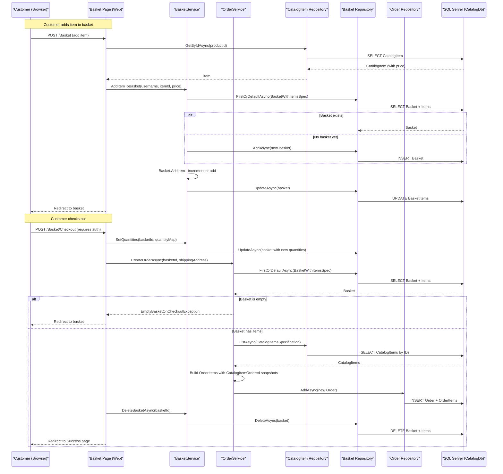

# Core Business Workflows

eShopOnWeb is an online retail storefront where customers browse a product catalog, manage a shopping basket, and place orders, while administrators manage the product catalog through a dedicated admin panel.

## Domain Entities

| Entity | Service / Bounded Context | Description | Key Relationships |
|---|---|---|---|
| CatalogItem | Catalog Management | A product available for sale with name, description, price, and picture | Belongs to one CatalogBrand and one CatalogType |
| CatalogBrand | Catalog Management | A product brand classification | Has many CatalogItems |
| CatalogType | Catalog Management | A product type/category classification | Has many CatalogItems |
| Basket | Shopping / Order Context | A shopping basket owned by a buyer (anonymous or authenticated) | Contains many BasketItems; buyer identified by string BuyerId |
| BasketItem | Shopping / Order Context | A line item in a basket referencing a catalog product | Belongs to one Basket; references CatalogItem by ID |
| Order | Order Management | A placed order owned by a buyer with a shipping address | Contains many OrderItems; buyer identified by string BuyerId |
| OrderItem | Order Management | A line item in an order, storing a price snapshot and quantity | Belongs to one Order; contains a CatalogItemOrdered snapshot |
| CatalogItemOrdered | Order Management | A value object snapshot of catalog item details at order time | Embedded in OrderItem; decoupled from live CatalogItem |
| Address | Order Management | A value object representing a shipping address | Owned by Order (embedded, not a separate table) |
| ApplicationUser | Identity / Authentication | A registered user with credentials and roles | Managed by ASP.NET Core Identity; linked to Basket/Order via username string |

## Service-to-Domain Mapping

| Service | Domain Context | Owned Entities | External Dependencies |
|---|---|---|---|
| Web (Razor Pages / MVC) | Shopping, Order Placement, User Auth | Basket, BasketItem, Order, OrderItem (via ApplicationCore services) | AppIdentityDbContext (user auth); CatalogContext (catalog, basket, orders) |
| PublicApi (REST API) | Catalog Management, API Authentication | CatalogItem, CatalogBrand, CatalogType (read/write via repo) | CatalogContext; AppIdentityDbContext (for JWT auth) |
| BlazorAdmin (WASM SPA) | Catalog Administration | CatalogItem, CatalogBrand, CatalogType (via PublicApi REST) | PublicApi endpoints only |
| ApplicationCore (library) | All domain contexts | Defines all domain entities and service interfaces; no direct DB access | None (persistence-agnostic) |
| Infrastructure (library) | Data access for all contexts | Implements EF Core repositories for CatalogContext and AppIdentityDbContext | SQL Server / InMemory |

Both Web and PublicApi connect independently to the same SQL Server databases. There is no inter-service messaging; data sharing is achieved through direct database access by both services.

## Primary Workflows

### Workflow 1: Customer Browses Catalog and Adds Item to Basket

1. Customer visits the home page (`/`) or catalog page.
2. The Razor Page reads the customer's basket cookie or uses the authenticated username as the basket identifier.
3. Catalog items are fetched from `CatalogContext` via `IRepository<CatalogItem>` using `CatalogFilterPaginatedSpecification` (optional brand/type filters, paging).
4. Customer submits "Add to Cart" (`POST /Basket`). The basket item is added via `BasketService.AddItemToBasket()`:
   - If no basket exists for the buyer, a new `Basket` is created.
   - `Basket.AddItem()` checks whether the catalog item already exists in the basket; if so, increments quantity, otherwise adds a new `BasketItem`.
5. The basket is persisted and the customer is redirected back to the basket page.

**Business rules involved:** Anonymous basket identified by a persistent cookie (GUID); price is read from the catalog at add-to-basket time (not re-validated at checkout).

### Workflow 2: Customer Checkout — Place Order

1. Customer navigates to `/Basket/Checkout` (requires authentication — `[Authorize]`).
2. The system loads the current basket for the authenticated user.
3. Customer confirms checkout (POST). The system:
   - Calls `BasketService.SetQuantities()` to apply any final quantity adjustments.
   - Calls `OrderService.CreateOrderAsync(basketId, shippingAddress)`:
     - Loads basket with items from `CatalogContext`.
     - Guards against null basket and empty basket (throws `EmptyBasketOnCheckoutException`).
     - Fetches current catalog items by IDs to build order item snapshots.
     - Creates `CatalogItemOrdered` value objects (snapshot of name and picture URI at order time).
     - Creates a new `Order` aggregate with the buyer ID, shipping address, and order items.
     - Persists the `Order` to `CatalogContext`.
   - Calls `BasketService.DeleteBasketAsync()` to clear the basket after successful order placement.
4. On success, customer is redirected to `/Basket/Success`.
5. On `EmptyBasketOnCheckoutException`, customer is redirected back to `/Basket/Index`.

**Business rules involved:** Basket must not be empty at checkout; shipping address is currently hardcoded (no real address input); basket is deleted after order creation.

### Workflow 3: Anonymous-to-Authenticated Basket Transfer

1. An anonymous customer adds items to a basket identified by a cookie GUID.
2. The customer logs in (ASP.NET Core Identity cookie authentication).
3. `BasketService.TransferBasketAsync(anonymousId, userName)` is called after sign-in:
   - Loads the anonymous basket by GUID.
   - If the user already has a basket, merges all items into the existing basket.
   - If not, creates a new basket for the authenticated username.
   - Deletes the anonymous basket.

### Workflow 4: Admin Manages Catalog Items (via BlazorAdmin)

1. Admin authenticates via `POST /api/authenticate` (PublicApi), receiving a JWT token.
2. Admin browses catalog items (`GET /api/catalog-items`, public) — paginated, filterable by brand/type.
3. Admin creates a new item (`POST /api/catalog-items`, requires Administrators JWT role):
   - Checks for duplicate name via `CatalogItemNameSpecification`; throws `DuplicateException` if found.
   - Creates a new `CatalogItem`; assigns a default placeholder picture URI.
   - Persists via `IRepository<CatalogItem>`.
4. Admin updates an item (`PUT /api/catalog-items`, requires Administrators JWT role):
   - Loads existing item; returns 404 if not found.
   - Updates name, description, price, brand, and type.
5. Admin deletes an item (`DELETE /api/catalog-items/{id}`, requires Administrators JWT role):
   - Returns 404 if item not found; otherwise deletes.

## Cross-Service Data Flows

The eShopOnWeb solution is a monolith split into two deployable services (Web and PublicApi), not a microservice architecture. There is no gateway aggregation layer. Both services share the same SQL Server databases directly:

- **Web service** owns the shopping and order placement workflow, reading from and writing to `CatalogContext` directly (catalog browsing, basket management, order creation) and `AppIdentityDbContext` (user authentication).
- **PublicApi service** owns catalog administration (CRUD on CatalogItem, CatalogBrand, CatalogType) and JWT authentication, also reading from and writing to `CatalogContext` and `AppIdentityDbContext` directly.
- **BlazorAdmin** is the only cross-service consumer: the WASM SPA calls PublicApi REST endpoints over HTTP. There is no REST communication from Web to PublicApi or vice versa.

**No circuit breaker or fallback logic** is implemented for cross-service calls. If PublicApi is unavailable, BlazorAdmin will fail to load catalog data.

## Business Workflow Sequence

## Business Rules & Decision Logic

### Validation Rules

- **Basket not empty at checkout**: `Guard.Against.EmptyBasketOnCheckout(basket.Items)` — throws `EmptyBasketOnCheckoutException` if the basket has no items when checkout is attempted.
- **Catalog item exists before adding to basket**: Basket page verifies the catalog item exists before adding; redirects to home if not found.
- **No duplicate catalog item names**: `CreateCatalogItemEndpoint` checks for existing items with the same name; throws `DuplicateException` if a duplicate is found.
- **Positive catalog item ID**: `CatalogItemOrdered` guard ensures `catalogItemId > 0`.
- **Non-empty product name and picture URI**: `CatalogItemOrdered` guards against null or empty name and picture URI.
- **Non-negative/zero basket item quantity**: `BasketItem.SetQuantity()` and `AddQuantity()` use `Guard.Against.OutOfRange` to prevent zero or negative quantities.
- **ModelState validation**: Checkout and basket update forms check `ModelState.IsValid` before proceeding.

### State Transitions

| Entity | States / Lifecycle |
|---|---|
| Basket | Created (on first add) → Items updated (add/update quantities) → Deleted (after order creation) |
| Order | Created (single state; no status progression in this implementation) |
| BasketItem | Added → Quantity updated → Removed (quantity set to 0, then `RemoveEmptyItems()` clears it) |

### Business Constraints

- **Checkout requires authentication**: `/Basket/Checkout` has `[Authorize]` — unauthenticated users are redirected to login.
- **Catalog write operations require Administrators role**: POST/PUT/DELETE on `/api/catalog-items` require JWT with Administrators role claim.
- **Anonymous basket lifetime**: 10 years cookie expiry; basket persists across browser sessions for anonymous users.
- **Price snapshot at basket add time**: Price is captured from the catalog when an item is added to the basket and is not re-validated at checkout (price drift risk if catalog price changes).
- **Order item as catalog snapshot**: `CatalogItemOrdered` preserves product name and picture URI at order time; future catalog changes do not retroactively modify historical orders.
- **Hardcoded shipping address**: Checkout currently uses a hardcoded placeholder address (`"123 Main St., Kent, OH"`); real address capture is not implemented.

### Cross-Cutting Concerns

- **Transactions**: No explicit `TransactionScope` or `IDbContextTransaction` usage; EF Core `SaveChanges()` is called per repository operation. Multi-step workflows (e.g., create order + delete basket) are not wrapped in a single database transaction — partial failure is possible.
- **Error handling**: `EmptyBasketOnCheckoutException` is caught at the page handler level and results in a redirect. `DuplicateException` and `BasketNotFoundException` propagate as unhandled exceptions (no global exception handler specifically for these).
- **Authorization**: Role-based authorization (`Administrators` role) for admin catalog operations; resource ownership checked implicitly via `BuyerId` in basket and order queries.
- **Logging**: `IAppLogger<T>` (adapter over `ILogger<T>`) used in `BasketService.SetQuantities()` to log quantity updates; no structured business event audit trail.
