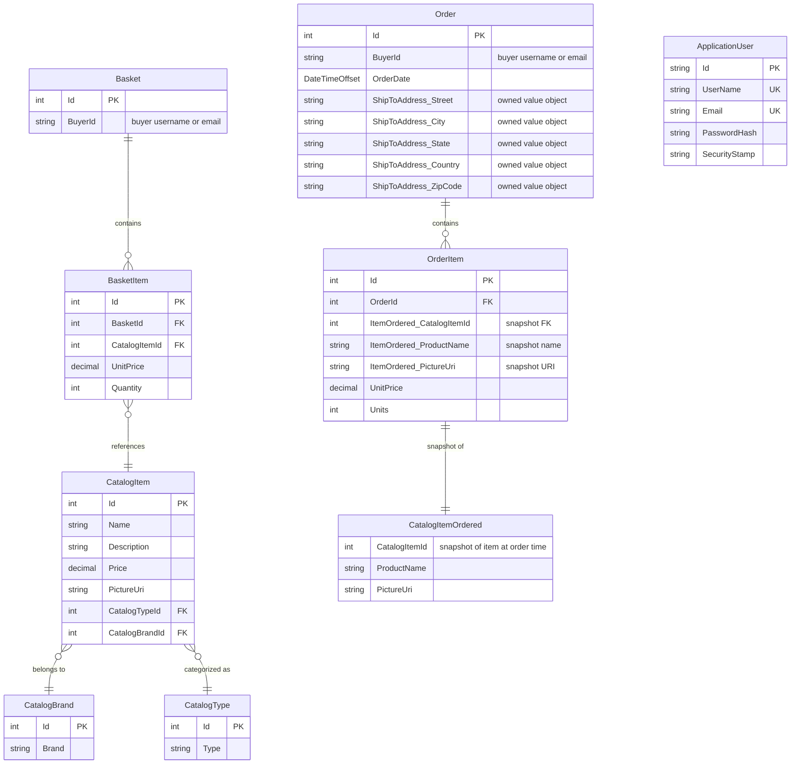

# Data Architecture & Persistence Layer

eShopOnWeb uses two EF Core `DbContext` instances backed by SQL Server: `CatalogContext` managing 7 domain entities (catalog, basket, and order aggregates) and `AppIdentityDbContext` managing ASP.NET Core Identity tables. Schema migrations are handled via EF Core Migrations.

## Database Configuration

| Service / Module | DB Type | Profile | Driver | Connection | Migration Tool |
|---|---|---|---|---|---|
| Infrastructure (CatalogContext) | SQL Server | Development / Docker | Microsoft.EntityFrameworkCore.SqlServer | LocalDB via appsettings.json ConnectionStrings:CatalogConnection | EF Core Migrations |
| Infrastructure (CatalogContext) | SQL Server | Production | Microsoft.EntityFrameworkCore.SqlServer | Azure SQL; connection string resolved from Azure Key Vault at runtime | EF Core Migrations |
| Infrastructure (CatalogContext) | In-Memory | Test | Microsoft.EntityFrameworkCore.InMemory | In-process; no connection string | None (schema auto-created) |
| Infrastructure (AppIdentityDbContext) | SQL Server | Development / Docker | Microsoft.EntityFrameworkCore.SqlServer | LocalDB via appsettings.json ConnectionStrings:IdentityConnection | EF Core Migrations |
| Infrastructure (AppIdentityDbContext) | SQL Server | Production | Microsoft.EntityFrameworkCore.SqlServer | Azure SQL; connection string resolved from Azure Key Vault at runtime | EF Core Migrations |
| Infrastructure (AppIdentityDbContext) | In-Memory | Test | Microsoft.EntityFrameworkCore.InMemory | In-process | None (schema auto-created) |

Seed data is applied programmatically at startup via `CatalogContextSeed.SeedAsync()` (catalog items, brands, types) and `AppIdentityDbContextSeed.SeedAsync()` (default admin and buyer users/roles).

## Data Ownership per Service

| Service | Tables / Entities Owned | ORM Framework | Caching | Notes |
|---|---|---|---|---|
| Infrastructure / ApplicationCore | Basket, BasketItem, CatalogItem, CatalogBrand, CatalogType, Order, OrderItem | EF Core 8 (CatalogContext) | IMemoryCache (in Web project) | Single shared CatalogContext for all domain aggregates |
| Infrastructure / Identity | ApplicationUser, AspNetRoles, AspNetUserRoles, AspNetUserClaims, etc. (standard Identity schema) | EF Core 8 (AppIdentityDbContext) | None | Inherits from IdentityDbContext |

## Entity Model

## Key Repository Methods

| Service | Repository / Interface | Notable Custom Methods | Purpose |
|---|---|---|---|
| Infrastructure | `EfRepository<T> : IRepository<T>, IReadRepository<T>` | Inherits `GetByIdAsync`, `ListAsync`, `AddAsync`, `UpdateAsync`, `DeleteAsync`, `CountAsync` from Ardalis.Specification.EntityFrameworkCore `RepositoryBase<T>` | Generic EF Core-backed repository for all aggregate roots |
| Infrastructure | `BasketQueryService : IBasketQueryService` | `CountTotalBasketItems(string username)` | Performs SUM of basket item quantities server-side via EF LINQ; avoids loading full basket graph into memory |
| ApplicationCore | `IRepository<T>` (interface) | Specification-based `ListAsync(ISpecification<T>)`, `CountAsync(ISpecification<T>)` | Defined in ApplicationCore; implemented in Infrastructure to keep domain layer persistence-agnostic |

Specifications used (Ardalis.Specification pattern):
- `CatalogFilterSpecification` — filters by brand and type
- `CatalogFilterPaginatedSpecification` — adds paging (skip/take) on top of filter
- `CatalogItemNameSpecification` — finds items by exact name (used for duplicate check on create)
- `BasketWithItemsSpecification` — eager-loads basket with its items by buyer ID

## Caching Strategy

| Layer | Provider | Scope | Pattern | Notes |
|---|---|---|---|---|
| Web application | `IMemoryCache` (ASP.NET Core built-in) | Per-process (in-memory) | Cache-aside | Registered via `builder.Services.AddMemoryCache()` in Web; used for basket item count on the navigation bar |

No distributed cache (Redis, SQL-backed) is configured. No EF Core second-level cache or query result cache is used. Cache TTL and eviction policies are not explicitly configured beyond the default `IMemoryCache` behavior (LRU-style, memory pressure eviction).

## Data Ownership Boundaries

Both `CatalogContext` and `AppIdentityDbContext` share the same SQL Server instance (two separate databases on the same server in development; two separate Azure SQL databases in production). There is no physical database-per-service isolation: all domain data (basket, catalog, orders) is in `CatalogDb` and identity data is in `Identity` DB.

Cross-service data access within the same process uses the repository interfaces (`IRepository<T>`) directly — there are no inter-process REST calls between Web and PublicApi for data access; both services connect independently to the same SQL Server databases. The `BuyerId` field on `Basket` and `Order` stores the user's username string (from ASP.NET Core Identity), creating a logical foreign key reference across database boundaries that is not enforced at the database level.

The `OrderItem` entity stores a denormalized snapshot (`CatalogItemOrdered`) of the catalog item's name and picture URI at order time, decoupling order history from future catalog changes. This is a read pattern enabling order history display without joining to the catalog table.

No CQRS, event sourcing, or outbox patterns are implemented.

### Data Classification & Sensitivity

| Entity | Sensitive Fields | Classification | Controls in Place |
|---|---|---|---|
| Order | BuyerId (username/email), ShipToAddress (street, city, state, country, zip code) | PII | No encryption-at-rest, no field-level masking configured in the application layer; relies on SQL Server / Azure SQL encryption at the infrastructure level if enabled |
| Basket | BuyerId (username/email) | PII | No application-level encryption or masking |
| ApplicationUser | UserName, Email, PasswordHash, PhoneNumber | PII | Passwords stored as ASP.NET Core Identity salted hash (PBKDF2); email stored in plaintext; no field-level encryption or masking |
| CatalogItem, CatalogBrand, CatalogType, OrderItem | None | None | No sensitive data |

No PHI (health records) or PCI (payment card) data is stored. The application does not process or store payment card numbers; checkout flow does not include a payment step in this reference implementation.
