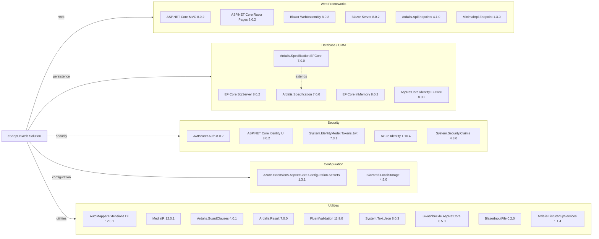

# Dependency Map

eShopOnWeb is an ASP.NET Core (.NET 8) multi-project solution with centrally managed package versions. It declares approximately 35 production/runtime NuGet packages and 10 test-scoped packages across 6 source projects.

## Dependencies

### Dependency Summary

| Category | Count | Key Libraries | Notes |
|---|---|---|---|
| Web Frameworks | 6 | ASP.NET Core MVC/Razor Pages 8.0.2, Blazor WASM 8.0.2, Ardalis.ApiEndpoints 4.1.0 | Dual hosting: MVC+Razor for storefront, Blazor WASM for admin |
| Database / ORM | 5 | EF Core SqlServer 8.0.2, Ardalis.Specification 7.0.0 | Central package versioning; InMemory provider included for testing |
| Security | 5 | JWT ****** ASP.NET Core Identity UI 8.0.2, Azure.Identity 1.10.4 | Dual auth: cookie (Web) + JWT (API) |
| Configuration | 2 | Azure Key Vault 1.3.1, Blazored.LocalStorage 4.5.0 | Azure Key Vault for production secrets |
| Utilities | 9 | AutoMapper 12.0.1, MediatR 12.0.1, FluentValidation 11.9.0, Swashbuckle 6.5.0 | Assorted helpers; Swashbuckle for OpenAPI docs |

### Version & Compatibility Risks

All production dependencies target .NET 8 and their versions are consistent with .NET 8 releases. The main version concern is `System.Security.Claims 4.3.0`, which is an older package that predates .NET Core and is now superseded by built-in BCL types. `BlazorInputFile 0.2.0` is a legacy community package that has been largely superseded by the built-in `InputFile` component added in .NET 6. `Microsoft.AspNetCore.Mvc 2.2.0` appears in the centralized package props but targets an older version; it is not referenced by any project currently. `Swashbuckle.AspNetCore 6.5.0` should be noted for migration to .NET 9+ where Microsoft now ships a built-in OpenAPI package.

### Notable Observations

- **Dual EF Core database contexts**: The solution uses two separate `DbContext` instances (`CatalogContext` and `AppIdentityDbContext`) targeting two separate SQL Server databases, adding operational complexity for schema migration management.
- **Legacy BlazorInputFile**: `BlazorInputFile 0.2.0` is a deprecated third-party component; .NET 6+ ships a native `InputFile` Blazor component that should replace it.
- **Unused package version declaration**: `Microsoft.AspNetCore.Mvc 2.2.0` is declared in `Directory.Packages.props` but not referenced by any project, creating a misleading version entry.
- **InMemory EF Core in production projects**: `Microsoft.EntityFrameworkCore.InMemory` is referenced by both `Web` and `PublicApi` production projects (not just test projects), which is typically a testing-only pattern and may indicate development shortcuts.

## Test Dependencies

| Framework | Version | Notes |
|---|---|---|
| xunit | 2.7.0 | Primary test framework across Unit, Integration, and Functional test projects |
| xunit.runner.visualstudio | 2.5.6 | Visual Studio / VS Code test runner adapter |
| xunit.runner.console | 2.7.0 | Console test runner for CI |
| Microsoft.NET.Test.Sdk | 17.9.0 | Core .NET test SDK |
| NSubstitute | 5.1.0 | Mocking framework used in Unit and Integration tests |
| NSubstitute.Analyzers.CSharp | 1.0.17 | Roslyn analyzer companion to NSubstitute |
| MSTest.TestAdapter | 3.2.2 | MSTest adapter used in PublicApiIntegrationTests |
| MSTest.TestFramework | 3.2.2 | MSTest framework used in PublicApiIntegrationTests |
| Microsoft.AspNetCore.Mvc.Testing | 8.0.2 | In-process test server for functional and integration tests |
| coverlet.collector | 6.0.2 | Code coverage data collector |

Total test-scope dependencies: 10

The test suite uses a mixed approach: xUnit for most projects and MSTest for the PublicApi integration tests. `Microsoft.AspNetCore.Mvc.Testing` is correctly used for in-process functional testing. No dedicated contract-testing or load-testing library is present. The `dotnet-xunit` CLI tool (version 2.3.1) referenced in FunctionalTests is outdated and superseded by the standard `dotnet test` workflow.
