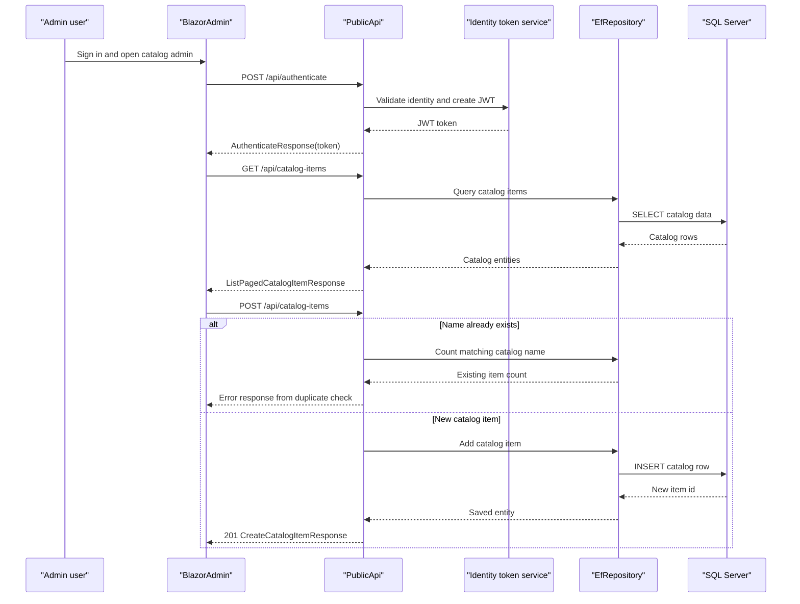

# API & Service Communication Contracts

This solution exposes a moderate HTTP surface split between a browser-facing web host and a separate JSON `PublicApi`, with most cross-service communication occurring synchronously over HTTPS. The only explicit service-to-service contract in the codebase is the Blazor admin client calling `PublicApi`; the storefront mostly talks to shared application services and repositories in-process.

## Service Catalog

| Service | Port | Category | Purpose |
|---|---|---|---|
| Web | `https://localhost:5001` / `http://localhost:5000` (`5106` in Docker) | API Layer | MVC storefront, Razor Pages checkout, Identity UI, health checks, and hosted Blazor assets |
| PublicApi | `https://localhost:5099` / `http://localhost:5098` (`5200` in Docker) | API Layer | JSON endpoints for authentication and catalog administration/browsing |
| BlazorAdmin | Hosted by `Web`; standalone dev profile also uses `5001/5000` | Business | Admin UI that composes lookup data and catalog item operations by calling `PublicApi` |
| ApplicationCore | n/a | Business | Shared basket, order, URI composition, and token-claim business services |
| Infrastructure | n/a | Infrastructure | EF Core repositories, query services, identity persistence, and logging adapters |

## API Endpoints Inventory

| Service | Method | Path | Request Type | Response Type |
|---|---|---|---|---|
| PublicApi | POST | `/api/authenticate` | `AuthenticateRequest` body | `AuthenticateResponse` with JWT/result flags |
| PublicApi | GET | `/api/catalog-brands` | none | `List<CatalogBrandDto>` response wrapper |
| PublicApi | GET | `/api/catalog-types` | none | `List<CatalogTypeDto>` response wrapper |
| PublicApi | GET | `/api/catalog-items` | Query params: `pageSize`, `pageIndex`, `catalogBrandId`, `catalogTypeId` via `ListPagedCatalogItemRequest` | `ListPagedCatalogItemResponse` |
| PublicApi | GET | `/api/catalog-items/{catalogItemId}` | Path param via `GetByIdCatalogItemRequest` | `GetByIdCatalogItemResponse` |
| PublicApi | POST | `/api/catalog-items` | `CreateCatalogItemRequest` body | `CreateCatalogItemResponse`, `201 Created` |
| PublicApi | PUT | `/api/catalog-items` | `UpdateCatalogItemRequest` body | `UpdateCatalogItemResponse`, `200 OK` or `404 Not Found` |
| PublicApi | DELETE | `/api/catalog-items/{catalogItemId}` | Path param via `DeleteCatalogItemRequest` | `DeleteCatalogItemResponse`, `200 OK` or `404 Not Found` |
| Web | GET | `/User` | Authenticated principal | `UserInfo` JSON |
| Web | POST | `/User/Logout` | none | `200 OK` |
| Web | GET | `/Order/MyOrders` | none | Razor view of `IEnumerable<OrderViewModel>` |
| Web | GET | `/Order/Detail/{orderId}` | Path param `orderId` | Razor view of `OrderDetailViewModel` |

## Management & Observability Endpoints

| Service | Endpoint | Custom Metrics (if any) |
|---|---|---|
| Web | `/health` | None found |
| Web | `/home_page_health_check` | None found |
| Web | `/api_health_check` | None found |
| Web | `/allservices` | Startup service inventory page; no custom metrics |
| PublicApi | `/swagger` and `/swagger/v1/swagger.json` | None found |

## DTOs & Contracts

`PublicApi` uses request/response contracts such as `AuthenticateRequest`, `AuthenticateResponse`, `CreateCatalogItemRequest`, `CreateCatalogItemResponse`, `UpdateCatalogItemRequest`, `UpdateCatalogItemResponse`, `DeleteCatalogItemResponse`, `ListPagedCatalogItemResponse`, `CatalogItemDto`, `CatalogBrandDto`, and `CatalogTypeDto`. The Blazor admin client consumes parallel UI-facing models from `BlazorShared` such as `CatalogItem`, `PagedCatalogItemResponse`, `EditCatalogItemResult`, and lookup responses for brands/types. Most DTOs are mutable C# classes serialized with `System.Text.Json`; OpenAPI metadata is provided by Swashbuckle annotations and generated Swagger documents. No protobuf or GraphQL schemas were found.

## Communication Patterns

The dominant communication style is synchronous HTTP. `BlazorAdmin` calls `PublicApi` with `HttpClient` using hard-coded `baseUrls.apiBase` configuration and performs lightweight client-side aggregation by loading catalog items in parallel with brand/type lookup lists before decorating the UI models. The storefront `Web` project does not call `PublicApi`; it talks to shared services and repositories in-process, so its cross-module communication is constructor-injected method calls and MediatR requests rather than network hops. No message brokers, background event handlers, circuit breakers, Polly retry policies, or service discovery frameworks were found. Startup order matters mostly in Docker and production deployment: `Web` and `PublicApi` both depend on SQL Server availability, and `Web` additionally depends on Azure Key Vault in non-development environments. Security posture is mixed but explicit: `Web` uses cookie authentication and authorization, `PublicApi` uses JWT bearer authentication for admin catalog mutations, both redirect to HTTPS, and several read endpoints remain publicly accessible by design.

## Service Technology Matrix

| Service | Web | Data Access | Discovery | Gateway | Actuator | Cache | Metrics |
|---|---|---|---|---|---|---|---|
| Web | MVC + Razor Pages + hosted Blazor | EF Core repositories and MediatR queries | None | No | ASP.NET Core health checks | IMemoryCache | No custom metrics |
| PublicApi | Minimal API endpoints + controllers | EF Core repositories | None | No | Swagger only | IMemoryCache registered, not a primary API cache | No custom metrics |
| BlazorAdmin | Blazor WebAssembly | HTTP calls to `PublicApi` | None | Client-side composition of lookup + item data | No | Browser local storage | No custom metrics |

## Service Communication Sequence

