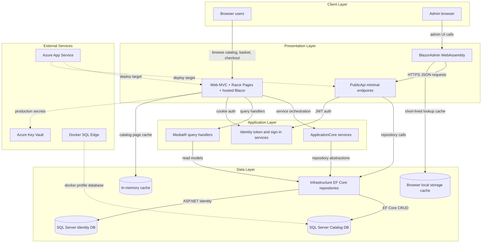
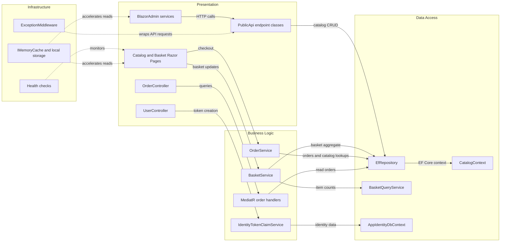

# Architecture Diagram

This repository contains a multi-project .NET e-commerce sample built around a server-rendered web storefront, a separate public API, and a Blazor WebAssembly admin experience. Shared application and infrastructure projects provide domain logic, persistence, identity, caching, and integration plumbing for both entry points.

## Application Architecture

### Technology Stack Summary

| Layer | Technology | Version | Purpose |
|---|---|---|---|
| Client | Browser + Blazor WebAssembly | .NET 8 | Admin UI and storefront interaction |
| Presentation | ASP.NET Core MVC, Razor Pages, MinimalApi.Endpoint | .NET 8 / MinimalApi.Endpoint 1.3.0 | Web UI and HTTP API surface |
| Application | ApplicationCore, MediatR, Ardalis.Specification | MediatR 12.0.1 / Ardalis.Specification 7.0.0 | Domain services, query handling, repository specifications |
| Data | EF Core + ASP.NET Identity | EF Core 8.0.2 / Identity 8.0.2 | Catalog, basket, order, and user persistence |
| Caching | IMemoryCache, Blazored.LocalStorage | Framework / 4.5.0 | Short-lived catalog and lookup caching |
| External | Azure Key Vault, Azure App Service, SQL Server / SQL Edge | Azure SDK 1.10.4 / SQL Edge container | Production secret retrieval and deployment/runtime hosting |

### Data Storage & External Services

The application persists catalog, basket, and order data through `CatalogContext` and stores user accounts through `AppIdentityDbContext`, both backed by SQL Server connection strings. The web host optionally reads production secrets from Azure Key Vault, while Docker-based local runs depend on an `azure-sql-edge` container. The solution also layers in-process memory caching for the storefront and browser local-storage caching for the admin client.

### Key Architectural Decisions

- Keeps domain logic in `ApplicationCore` and persistence concerns in `Infrastructure`, with both the web host and API consuming shared repository abstractions.
- Uses two user-facing entry points: the `Web` project serves the storefront and hosted Blazor assets, while `PublicApi` exposes a separate JSON API consumed by `BlazorAdmin`.
- Mixes synchronous repository-based domain operations with MediatR query handlers for read-focused storefront features such as order history.

## Component Relationships

### Component Inventory

| Component | Layer | Type | Responsibility |
|---|---|---|---|
| Catalog and Basket Razor Pages | Presentation | Razor Pages | Render the storefront, basket, and checkout flows |
| OrderController | Presentation | MVC Controller | Returns authenticated order history and detail views |
| UserController | Presentation | API Controller | Returns current user info and logs users out |
| PublicApi endpoint classes | Presentation | Minimal API endpoints | Expose catalog and authentication JSON endpoints |
| BlazorAdmin services | Presentation | Client service layer | Call `PublicApi` and compose lookup/item data for admin screens |
| BasketService | Business Logic | Domain service | Creates baskets, updates quantities, and transfers anonymous baskets |
| OrderService | Business Logic | Domain service | Validates checkout data and creates orders from basket items |
| MediatR order handlers | Business Logic | Query handlers | Build order summary and detail view models |
| IdentityTokenClaimService | Business Logic | Security service | Issues JWTs for authenticated API usage |
| EfRepository | Data Access | Repository | Shared specification-driven EF Core repository implementation |
| BasketQueryService | Data Access | Query service | Executes aggregate basket counts directly in SQL |
| CatalogContext / AppIdentityDbContext | Data Access | DbContext | Persist catalog/order data and ASP.NET Identity data |
