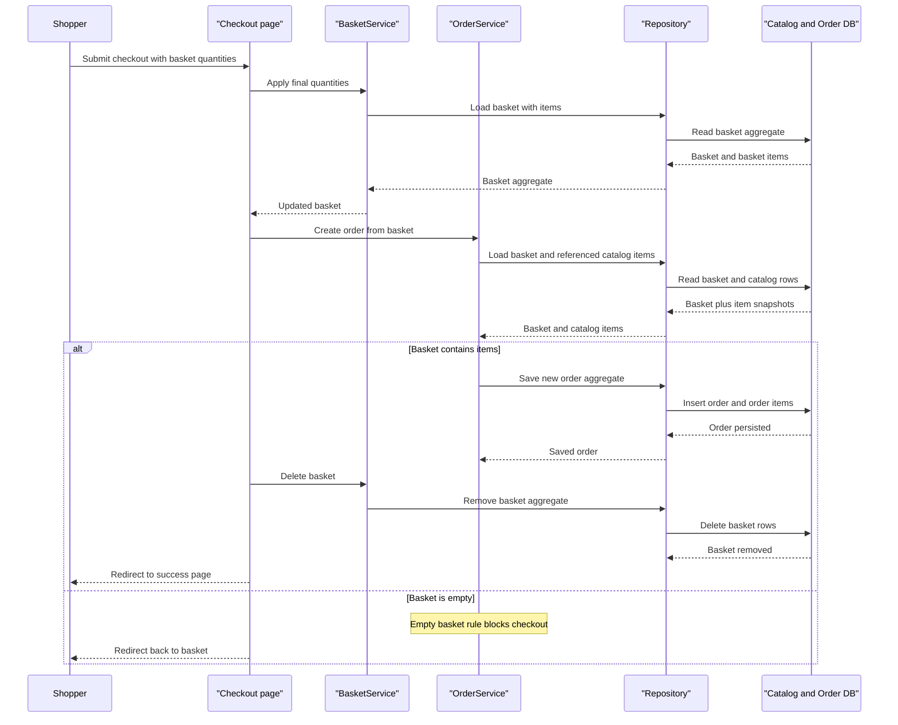

# Core Business Workflows

The application models a simple online storefront where shoppers browse catalog items, manage baskets, and place orders, while administrators maintain the catalog through both a hosted admin page and a separate Blazor admin client. Identity and order history features extend that core shopping flow with authenticated account management and post-purchase review.

## Domain Entities

| Entity | Service / Bounded Context | Description | Key Relationships |
|---|---|---|---|
| CatalogItem | Catalog Management | Sellable product with brand, type, image, and price | Belongs to a `CatalogBrand` and `CatalogType`; referenced by baskets and orders |
| CatalogBrand | Catalog Management | Product brand/category owner | One brand to many catalog items |
| CatalogType | Catalog Management | Product type classifier | One type to many catalog items |
| Basket | Shopping Basket | Customer or anonymous shopping cart aggregate | Contains many basket items; linked to a buyer identity/cookie |
| BasketItem | Shopping Basket | Quantity and unit-price snapshot of a selected catalog item | Belongs to one basket; references one catalog item |
| Order | Order Management | Completed checkout containing shipping address and order lines | Created from a basket; associated with a buyer |
| OrderItem | Order Management | Purchased line item snapshot captured at checkout | Belongs to one order |
| ApplicationUser | Identity | Authenticated shopper or admin user | Owns baskets/orders and may hold admin privileges |

## Service-to-Domain Mapping

| Service | Domain Context | Owned Entities | External Dependencies |
|---|---|---|---|
| Web | Storefront, basket, checkout, account management | Basket, Order, ApplicationUser views, catalog read models | Shared repositories, MediatR handlers, email sender, IMemoryCache |
| PublicApi | Catalog administration and API authentication | CatalogItem DTO contracts, authentication tokens | Shared repositories, ASP.NET Identity, JWT generation |
| BlazorAdmin | Catalog operations UI | No source-of-truth entities; consumes catalog DTOs | `PublicApi` over HTTP, browser local storage |
| ApplicationCore | Domain rules and orchestration | CatalogItem, Basket, Order aggregates and specifications | Repository abstractions |
| Infrastructure | Persistence and identity | EF Core context mappings and identity entities | SQL Server / in-memory store |

## Primary Workflows

### Workflow 1: Browse catalog and manage basket

The storefront home page loads filtered catalog items through `ICatalogViewModelService`, using the cached wrapper when possible to reduce repeated reads. Anonymous users receive a long-lived basket cookie; authenticated users use their identity name as the basket key. Adding or updating basket items routes through `BasketService`, which either creates a new basket or mutates the existing aggregate, then persists the result through the shared repository.

### Workflow 2: Checkout and place order

The authenticated checkout page loads the current basket, validates the posted quantities, then asks `BasketService` to apply the final quantities. `OrderService.CreateOrderAsync` rejects missing baskets and empty baskets, loads the referenced catalog items, snapshots product details into order lines, creates the order aggregate, and finally the checkout flow deletes the basket. If checkout finds an empty basket, the user is redirected back to the basket page instead of creating an order.

### Workflow 3: Sign in and merge anonymous basket

During login, the Identity page checks for an anonymous basket cookie. If a cookie-backed basket exists and the user authenticates successfully, `TransferBasketAsync` copies each line item into the user-owned basket, creates the target basket when needed, deletes the anonymous basket, and clears the cookie. This preserves cart state across the authentication boundary.

### Workflow 4: Maintain catalog as an administrator

Administrators can update catalog data in two ways. The hosted `Web` admin page edits a catalog item directly through `CatalogItemViewModelService` and the repository. The `BlazorAdmin` client performs synchronous HTTP calls to `PublicApi` for list, create, edit, and delete operations, enriching item records with brand/type lookup data before rendering. Create operations enforce a uniqueness rule on the catalog item name before persistence.

## Cross-Service Data Flows

The main cross-service flow is browser-to-API composition rather than microservice orchestration. `BlazorAdmin` loads catalog items from `PublicApi` while concurrently loading brand and type lookup lists, then merges those results client-side to display user-friendly names. The storefront `Web` project bypasses `PublicApi` and works directly with shared repositories, so the same underlying data can be reached either in-process (`Web`) or over HTTP (`BlazorAdmin` → `PublicApi`). If `PublicApi` calls fail, the admin client returns null/empty results and surfaces toast errors for create/update failures, which degrades the admin workflow but does not affect the storefront.

## Business Workflow Sequence

## Business Rules & Decision Logic

- Basket ownership is identity-based for signed-in users and cookie-based for anonymous users; login triggers basket transfer to preserve shopping state.
- `OrderService` enforces two critical checkout rules: the basket must exist, and it must contain at least one item before an order can be created.
- Order totals are computed from line-item quantity multiplied by unit price, using a product snapshot captured at order time rather than live catalog values.
- Catalog creation in `PublicApi` rejects duplicate item names before insert, and admin write endpoints are restricted to the administrator role with JWT bearer authentication.
- Quantity changes cannot be negative or out of range because `BasketItem` guard clauses validate quantity updates; setting quantity to zero removes empty items from the basket.
