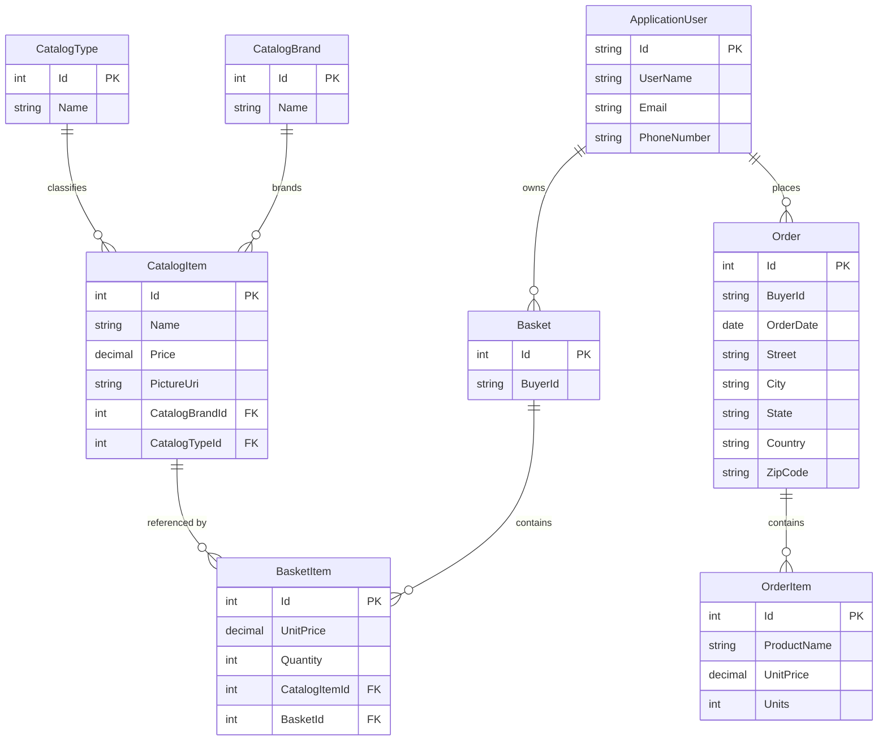

# Data Architecture & Persistence Layer

The data layer is centered on EF Core and ASP.NET Identity, with one catalog/order store and one identity store configured through SQL Server connection strings. Core domain persistence is concentrated in a small set of aggregates for catalog, basket, order, and user management, with caching added above the repository layer rather than inside the database access stack.

## Database Configuration

| Service/Module | DB Type | Profile | Driver | Connection | Migration Tool |
|---|---|---|---|---|---|
| Web | SQL Server | Development / default | `Microsoft.EntityFrameworkCore.SqlServer` | `ConnectionStrings:CatalogConnection`, `ConnectionStrings:IdentityConnection` | EF Core migrations plus programmatic seeding |
| Web | SQL Server via Azure SQL secrets | Production | `Microsoft.EntityFrameworkCore.SqlServer` | Key Vault-backed connection string keys resolved at startup | EF Core migrations plus programmatic seeding |
| Web | In-memory | Test-only support | `Microsoft.EntityFrameworkCore.InMemory` | `UseOnlyInMemoryDatabase=true` | No schema migration; runtime store only |
| PublicApi | SQL Server | Development / default | `Microsoft.EntityFrameworkCore.SqlServer` | Same connection string keys as `Web` | EF Core migrations plus programmatic seeding |
| PublicApi | In-memory | Test profile (`appsettings.test.json`) | `Microsoft.EntityFrameworkCore.InMemory` | `UseOnlyInMemoryDatabase=true` | No schema migration |
| Docker local run | SQL Server Edge | Docker | SQL Server protocol via EF Core | Containerized SQL host referenced by `appsettings.Docker.json` | EF Core migrations executed during startup seeding |

## Data Ownership per Service

| Service | Tables Owned | ORM Framework | Caching | Notes |
|---|---|---|---|---|
| ApplicationCore + Infrastructure | Catalog, CatalogBrands, CatalogTypes, Baskets, BasketItems, Orders, OrderItems | EF Core + Ardalis.Specification | None in repository layer | Shared persistence model used by both `Web` and `PublicApi` |
| Web | Reads/writes shared catalog, basket, order tables; reads identity users through ASP.NET Identity | EF Core repositories, MediatR, Identity | IMemoryCache for storefront responses | Uses same store directly instead of calling `PublicApi` |
| PublicApi | Reads/writes shared catalog tables; reads/writes identity users for authentication | EF Core repositories + ASP.NET Identity | No dedicated API cache | Admin-facing CRUD and token issuance over shared database |
| BlazorAdmin | No owned tables | n/a | Browser local storage | Consumes `PublicApi`; does not persist directly |

## Entity Model

## Key Repository Methods

| Service | Repository | Notable Methods | Purpose |
|---|---|---|---|
| Shared data access | `IRepository<T>` / `IReadRepository<T>` (`src/ApplicationCore/Interfaces`) | Inherited CRUD and specification methods such as `GetByIdAsync`, `ListAsync`, `FirstOrDefaultAsync`, `CountAsync`, `AddAsync`, `UpdateAsync`, `DeleteAsync` | Standardized aggregate persistence across catalog, basket, and order entities |
| Infrastructure | `EfRepository<T>` (`src/Infrastructure/Data/EfRepository.cs`) | EF Core implementation of the Ardalis specification repository base | Executes repository queries against `CatalogContext` |
| Basket workflow | `BasketWithItemsSpecification` | Load basket by id or buyer id with `Items` included | Supports basket display, quantity updates, and checkout |
| Catalog browse workflow | `CatalogFilterPaginatedSpecification` / `CatalogFilterSpecification` | Filter by brand/type with paging | Powers storefront and API catalog listing queries |
| Order history workflow | `CustomerOrdersSpecification` / `OrderWithItemsByIdSpec` | Query orders per user and order details with items | Supports order summary/detail read models |
| Query service | `BasketQueryService.CountTotalBasketItems` | Aggregate item quantities in SQL | Efficient basket badge/count calculation |

## Caching Strategy

The persistence layer itself is uncached, but two read-oriented caches sit immediately above it. `Web` uses `IMemoryCache` with a 30-second sliding expiration for catalog item pages, brand lists, and type lists. `UserController` and logout flows also use memory cache entries to support authentication revocation bookkeeping. `BlazorAdmin` adds a client-side cache backed by `Blazored.LocalStorage`, keeping catalog lookup lists and item lists for about one minute before refreshing from `PublicApi`. No distributed cache, second-level EF cache, or write-behind caching was found.

## Data Ownership Boundaries

The solution uses a shared-database model rather than database-per-service isolation. `Web` and `PublicApi` both read and write the same catalog/order store and share the same identity store; their separation is at the application boundary, not the data boundary. Cross-service access therefore happens in two ways: direct repository access inside `Web`, and HTTP calls from `BlazorAdmin` into `PublicApi`, which then uses the same repositories. Read/write behavior is classic CRUD plus specification-based querying; there is no CQRS data-store split, no outbox, and no event-driven replication. The one notable aggregation enabler is the specification/query-service pattern, which makes it easy to load baskets with items or summarize order history without duplicating raw SQL across entry points.

### Data Classification & Sensitivity

| Entity | Sensitive Fields | Classification (PII/PHI/PCI/None) | Controls in Place |
|---|---|---|---|
| CatalogBrand / CatalogType / CatalogItem | None beyond product metadata | None | Standard EF persistence only |
| Basket | `BuyerId` | PII-lite / account identifier | Stored as plain text identifier; no masking found |
| Order | Shipping address fields and `BuyerId` | PII | Protected by authenticated checkout flow, but no field-level masking or encryption configuration found |
| ApplicationUser | `UserName`, `Email`, `PhoneNumber` | PII | Managed through ASP.NET Identity; no explicit masking or encryption-at-rest configuration found in repo |
| OrderItem | Product snapshot and price only | None | Standard EF persistence only |
