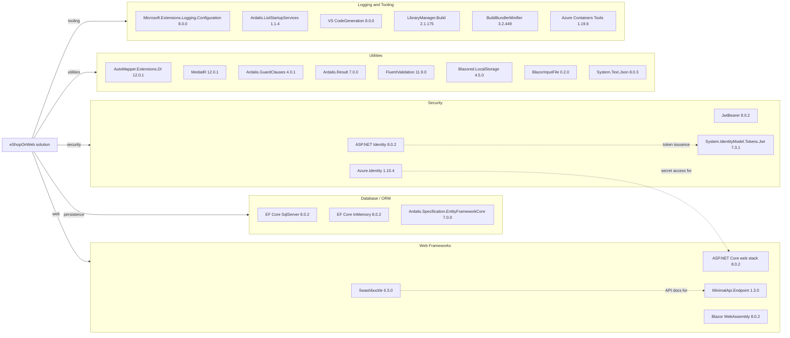

# Dependency Map

This solution declares a centrally managed .NET 8 dependency set spread across six production projects, with roughly 30 unique non-test packages and several additional test-only libraries. The main dependency clusters are ASP.NET Core web frameworks, EF Core persistence, identity/security packages, and UI/support utilities for the hosted Blazor admin experience.

## Dependencies

### Dependency Summary

| Category | Count | Key Libraries | Notes |
|---|---|---|---|
| Web Frameworks | 4 | ASP.NET Core web stack, MinimalApi.Endpoint, Blazor WebAssembly, Swashbuckle | Powers the MVC storefront, minimal API, and admin SPA |
| Database / ORM | 3 | EF Core SqlServer, EF Core InMemory, Ardalis.Specification.EntityFrameworkCore | Shared persistence stack for production and test/in-memory modes |
| Security | 4 | ASP.NET Identity, JwtBearer, System.IdentityModel.Tokens.Jwt, Azure.Identity | Covers cookie auth, JWT issuance, and Key Vault access |
| Utilities | 8 | AutoMapper, MediatR, GuardClauses, Result, FluentValidation, Blazored.LocalStorage, BlazorInputFile, System.Text.Json | Mixture of domain helpers, UI helpers, and client serialization |
| Logging and Tooling | 6 | Logging.Configuration, ListStartupServices, CodeGeneration, LibraryManager, BundlerMinifier, Azure Containers Tools | Mostly build-time or developer-experience dependencies |

### Version & Compatibility Risks

The baseline test run already reports known advisories against `System.Text.Json` 8.0.3 and `Azure.Identity` 1.10.4, so those packages are immediate compatibility and security review candidates. Several web/tooling packages are pinned to the .NET 8 generation, and the upgrade assessment also flags deprecated or upgrade-recommended packages such as `BuildBundlerMinifier`, older container tooling, and test support packages.

### Notable Observations

- Package versions are centrally managed through `Directory.Packages.props`, which simplifies coordinated framework upgrades across the solution.
- Both `Web` and `PublicApi` reference EF Core SQL Server and EF Core InMemory, indicating a shared production/test persistence model rather than isolated per-service package stacks.
- The admin experience mixes browser-side packages (`Blazored.LocalStorage`, `BlazorInputFile`) with server-hosted ASP.NET Core dependencies, so UI modernization risk spans both client and host projects.
- Swagger, code generation, bundling, and Visual Studio container tooling are all present, which increases the number of developer-only dependencies that may not be needed in a cloud-native target state.

## Test Dependencies

| Framework | Version | Notes |
|---|---|---|
| xUnit | 2.7.0 | Primary unit, integration, and functional test framework |
| xUnit runners | 2.5.6 / 2.7.0 | Visual Studio and console runners |
| MSTest.TestAdapter | 3.2.2 | Used by `PublicApiIntegrationTests` |
| MSTest.TestFramework | 3.2.2 | Used by `PublicApiIntegrationTests` |
| Microsoft.NET.Test.Sdk | 17.9.0 | Shared .NET test host |
| Microsoft.AspNetCore.Mvc.Testing | 8.0.2 | In-process host for functional/API tests |
| NSubstitute | 5.1.0 | Mocking for unit and integration tests |
| NSubstitute.Analyzers.CSharp | 1.0.17 | Analyzer package for tests |
| coverlet.collector | 6.0.2 | Coverage collection in API integration tests |
| EF Core InMemory | 8.0.2 | Test-time database substitute in several suites |

Total test-scope dependencies: 10

The repository has healthy coverage across unit, integration, functional, and API integration layers. Test infrastructure is modern overall, but the upgrade assessment flags some deprecated test packages, so the test stack will need review alongside the production dependency upgrade.
